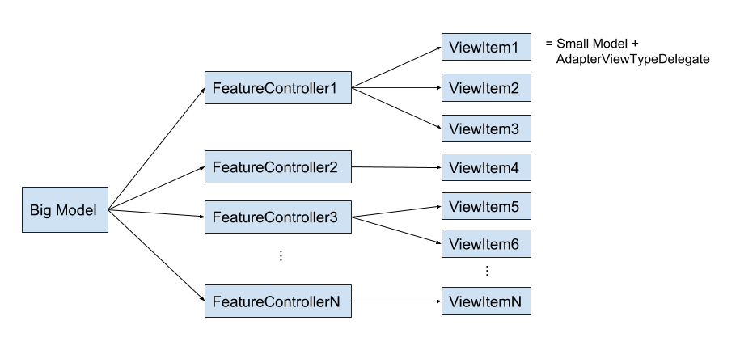

## FeatureAdapter
FeatureAdapter (FA) is an Android Library providing an optimized way to display complex screens on Android.

[](https://travis-ci.org/groupon/FeatureAdapter)
[](https://codecov.io/gh/groupon/FeatureAdapter)

It offers a RecyclerView adapter that allows to define multiple “features”. Each “feature” contains multiple items rendered by multiple view types.

Starting from version `2.x`, FeatureAdapter has been migrated to Android X and no longer supports android support library. If you want to use FeatureAdapter with android support library, use the version `1.y.z`. Version `2.x` are also based on Rx2, Rx1 is no longer supported.

## Design Overview
FA will help to render a complex screen on android inside a RecyclerView. By complex, we mean a compound view that is composed of multiple items rendered by multiple view types.

<p align="center">

</p>

**Big Model:**

The input of this screen is what we call “Big Model”, it’s a rich pojo that contains all (or most) of the information to render on the screen. We will render this “Big Model” inside a RecyclerView by splitting it into features. Each feature represents one aspect of the Big Model.

**Feature Controllers:**

To use FA, developers will have to define a list of FeatureControllers. The role of FeatureControllers is to isolate the business logic related to displaying one single feature. Each FeatureController will take the big model and produces a list of ViewItems. 

**ViewItems:**

Each view item represents one portion of the complex screen (usually one row, but FA supports alternative layouts). Every view item consists of one small model (derived from the big model) and an AdapterViewTypeDelegate that is used to render the small pojo on screen. 

## Highlights
FeatureAdapter is highly optimized. It uses the lazy rendering capability of the RecyclerView to render only the features that are shown on screen. It ensures blazing fast rendering, especially the Rx based [FA module](./feature-adapter-rx) as it uses parallel computation in a background thread pool.

FeatureAdapter not only displays features fast, it also updates them efficiently when the big model changes (FA uses DiffUtil). Only features that have changed are rendered again.

FA is highly customizable. For instance you can use custom renderers and custom ViewItem comparators and custom layouts, for each feature.

FA enforces separation and concerns by providing a full isolation of various features, allowing multiple teams to work on separate parts of the same screen

FA supports user interactions: each ViewItem can send events (FeatureEvent).

FA supports arbitrary complex grouping of ViewItems in a feature. GroupAdapterViewTypeDelegate will render multiple ViewItems on the same row.

FA supports custom animations and decorators for each feature.

## Setup
```
// to use vanilla FeatureAdapter
implementation 'com.groupon.android.feature-adapter:feature-adapter:x.y.z'
// to use FeatureAdapter with Rx
implementation 'com.groupon.android.feature-adapter:feature-adapter-rx:x.y.z'
// to group features on the same row
implementation 'com.groupon.android.feature-adapter:feature-adapter-group:x.y.z'
```

## Alternatives to FA
* [Epoxy](https://github.com/airbnb/epoxy)
* SimpleAdapter

